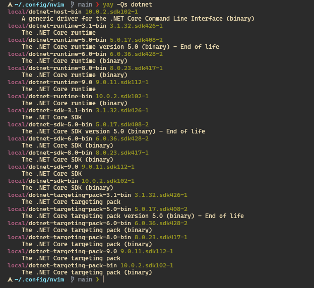

# Neovim

esta es la configuracion general; se debe de tener en cuenta que con `:Mazon` se debe de instalar los siguientes elementos para que todo corra perfetamente

Installed:
    * css-lsp
    * emmet-language-server
    * omnisharp
    * prettier
    * rust-analyzer
    * sql-formatter
    * tailwindcss-language-server
    * typescript-language-server


En teoria con eso debeeria de funcionar para todos los equipos por igual...

## paquetes DOTNET  en Arch_Linux

> [!WARNING]
> Estos paquetes son los instalados en la pc de lau donde todo corre de maravilla. informacion del 3 de febrero  del 2026. 



el listado queda asi: 

* dotnet-host-bin 10.0.2.sdk102-1
* dotnet-runtime-3.1-bin 3.1.32.sdk426-1
* dotnet-runtime-5.0-bin 5.0.17.sdk408-2
* dotnet-runtime-6.0-bin 6.0.36.sdk428-2
* dotnet-runtime-8.0-bin 8.0.23.sdk417-1
* dotnet-runtime-9.0 9.0.11.sdk112-1
* dotnet-runtime-bin 10.0.2.sdk102-1
* dotnet-sdk-3.1-bin 3.1.32.sdk426-1
* dotnet-sdk-5.0-bin 5.0.17.sdk408-2
* dotnet-sdk-6.0-bin 6.0.36.sdk428-2
* dotnet-sdk-8.0-bin 8.0.23.sdk417-1
* dotnet-sdk-9.0 9.0.11.sdk112-1
* dotnet-sdk-bin 10.0.2.sdk102-1
* dotnet-targeting-pack-3.1-bin 3.1.32.sdk426-1
* dotnet-targeting-pack-5.0-bin 5.0.17.sdk408-2
* dotnet-targeting-pack-6.0-bin 6.0.36.sdk428-2
* dotnet-targeting-pack-8.0-bin 8.0.23.sdk417-1
* dotnet-targeting-pack-9.0 9.0.11.sdk112-1
* dotnet-targeting-pack-bin 10.0.2.sdk102-1

puede usar el siguiente comando para instalarlos todos de golpe: 

```bash
yay -S dotnet-host-bin dotnet-runtime-3.1-bin dotnet-runtime-5.0-bin dotnet-runtime-6.0-bin dotnet-runtime-8.0-bin dotnet-runtime-9.0 dotnet-runtime-bin dotnet-sdk-3.1-bin dotnet-sdk-5.0-bin dotnet-sdk-6.0-bin dotnet-sdk-8.0-bin dotnet-sdk-9.0 dotnet-sdk-bin dotnet-targeting-pack-3.1-bin dotnet-targeting-pack-5.0-bin dotnet-targeting-pack-6.0-bin dotnet-targeting-pack-8.0-bin dotnet-targeting-pack-9.0 dotnet-targeting-pack-bin 
```
